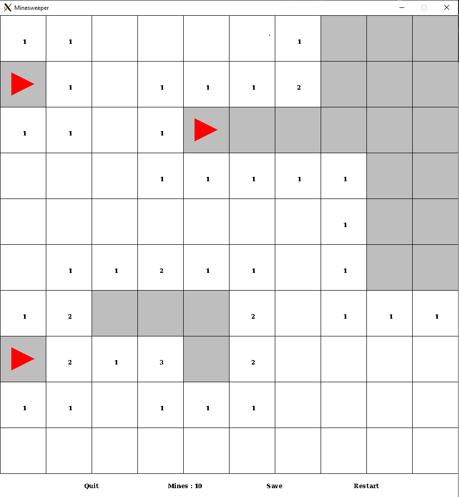

# Démineur - Laborde Quentin, Kies Rémy 


___



Sommaire :
- [Démineur - Laborde Quentin, Kies Rémy](#démineur---laborde-quentin-kies-rémy)
  - [Manuel utilisateur](#manuel-utilisateur)
    - [Compilation](#compilation)
    - [Arguments optionnels](#arguments-optionnels)
    - [Jeu](#jeu)
  - [Fonctionnalités](#fonctionnalités)
  - [Divergeances avec l'énnoncé](#divergeances-avec-lénnoncé)
  - [Conclusion](#conclusion)

## Manuel utilisateur

### Compilation

> ```bash
> clang -std=c17 -Wall -Wfatal-errors minesweeper.c -o mine -lMLV
> ```

### Arguments optionnels

> Graine donnée :
> ```bash
> ./mine [-a seed]
> ```
> Les dimensions de la grille par défaut sont 10 par 10 avec 10 mines.

> Génération d'une grille de taille donnée:
> ```bash
> ./mine [-j h l m]
> ```
> où `h` vaut la hauteur du jeu, `l` la largeur et `m` le nombre de mines.
> Il faut que le nombre de mines soit inférieur à `l*m`.

> Génération d'une grille à partir d'un fichier:
> ```bash
> ./mine [filename]
> ```
> Si le fichier est inexistant ou non valide, une grille est générée aléatoirement.

Les arguments ci-dessus peuvent être combinés ou non.
Le programme peut être lancé sans arguments, et génèrera donc une grille de 10 par 10 aléatoire avec 10 mines.

### Jeu

Les règles sont les règles classiques du démineur.

Une fois le programme lancé, l'utilisateur peut interargir avec la souris :
* Le `clique gauche` révèle une case.
* Le `clique droit` pose ou retire un drapeau. 


## Fonctionnalités

Les fonctionnalités sont :
* Sauvegarde
  * L'utilisateur peut décider de sauvegarder dans un fichier `save.ga` la partie en cours.
* Recommencer
  * L'utilisateur peut recommencer à n'importe quel moment sa partie. La partie redevient à son stade initial, et non pas au niveau de la sauvegarde : il faudra donc relancer avec la commande `./mine save.ga`. Si le fichier ``save.ga`` est innexistant, il est automatique crée. S'il existe, son contenu est supprimé pour contenir la nouvelle grille (donc la sauvegarde est unique).
* Quitter
  * L'utilisateur peut quitter soit en cliquant sur le bouton "Quit", soit en se servant de la `X` croix en haut de la fenêtre.

## Divergeances avec l'énnoncé

Nous nous sommes un peu éloigné du sujet sur plusieurs point tels que :
* L'option `-3` 3D n'a pas été faite car déraisonnable avec la libMLV qui était imposée.
* L'option `-u` de sauvegarde a chaque coup a été "améliorée", par il était étrange d'effacer un fichier et de le recréer pour chaque coup. Nous avons donc choisi d'implémenter un bouton sauvegarde, pour que l'utilisateur puisse sauvgarder quand il le souhaite.
* Dans le vrai démineur, lorsque l'utilisateur perd, toutes les mines sont révélées. Ici, avec l'option "Recommencer", révéler les mines quand on perd c'est un peu comme tricher ! Cela n'a donc pas été implémenté. 

## Conclusion

Globalement, nous avons bien aimé le sujet compte tenu de nos 2 mois de programmation en C. Ayant déjà joué au démineur, il était agréable d'en créer un nous même (même si le sujet n'était pas toujours très clair ...). Le fait aussi que ce soit un jeu avec une partie graphique rend aussi la programmation sympatique, avec un résultat satisfaisant.
___
Laborde Quentin, Kies Rémy 