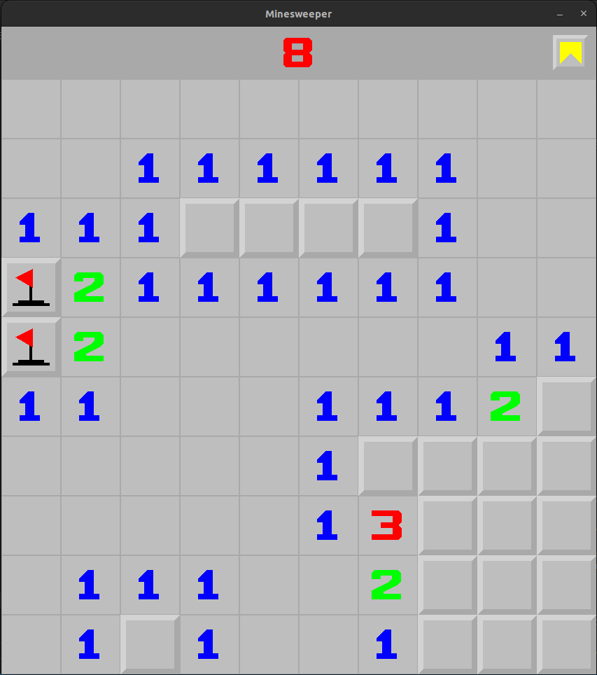

# Minesweeper - Laborde Quentin, Kies Rémy 


___



Sommaire :
- [Minesweeper - Laborde Quentin, Kies Rémy](#minesweeper---laborde-quentin-kies-rémy)
  - [User Manual](#user-manual)
    - [Compilation](#compilation)
    - [Cleaning](#cleaning)
    - [Optionnal arguments](#optionnal-arguments)
    - [Game](#game)
  - [Feature :](#feature-)

## User Manual

### Compilation

> ```bash
> cd new
> make
> ```

### Cleaning
>```bash
> cd new
> make mrproper
> ```

### Optionnal arguments

> Choose random seed :
> ```bash
> ./minesweeper [-r seed]
> ```
> The default grid is a 10x10 size with 10 mines.

> Generate a grid with parameters:
> ```bash
> ./minesweeper [-c "h l m"]
> ```
> Where `h` signify the height, `w` the width and `m` the number of mines.\
> The number of mines `m` must be lower than the number of tiles `l*m`.

> Generate a map from a map file (.ga):
> ```bash 
> ./mine [filename]
> ```
> If the file doesn't exist a random map will be generated.

You can use multiple argument at the same time.\
The game can be lunch without argument, the program will lunch a 10x10 grid with 10 mines.

### Game

Rules are the same as a classic minesweeper.\

When the program is lunch, the user can :
* Use `left click` reveal a tile.
* Use `right click` place or remove a flag. 


## Feature :

* Save
  * The user can save at any moment the game, the save will go in the folder `grid` than in the file `save.ga`.
___
Laborde Quentin, Kies Rémy 